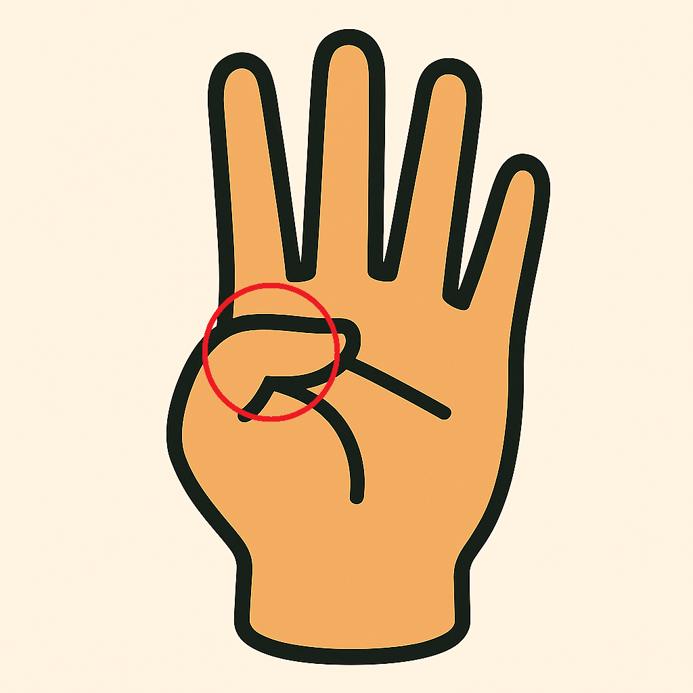
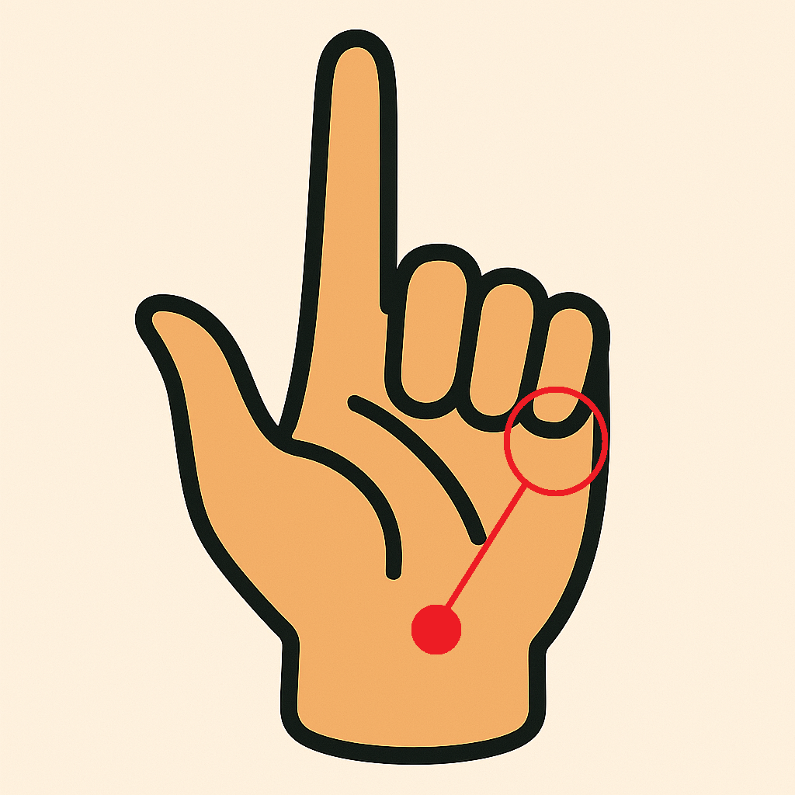
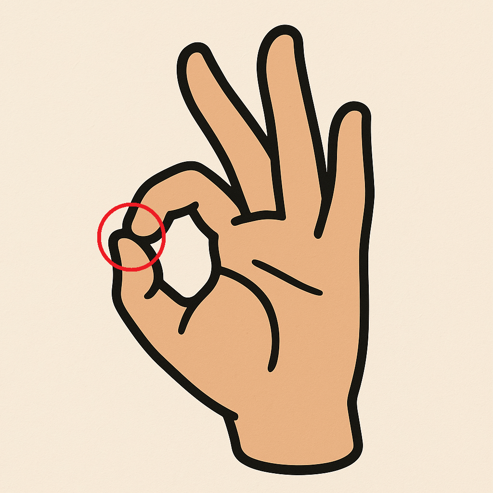
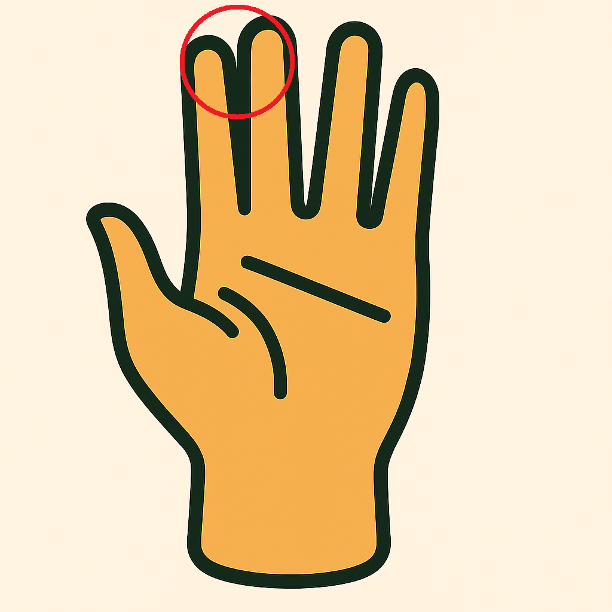
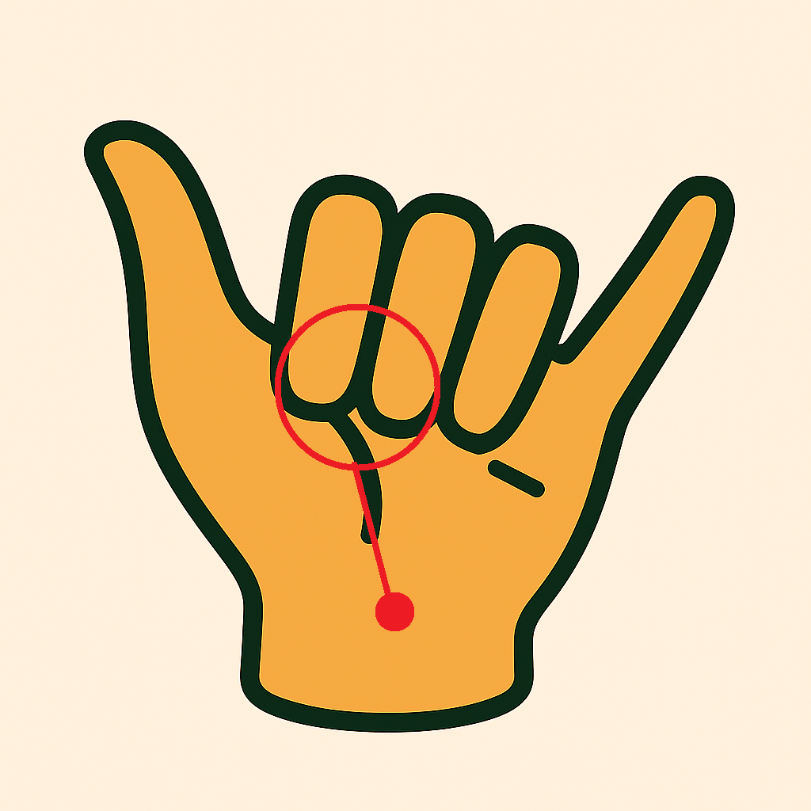

# Alea-AirCursor

Experience the future of touchless interaction with **Alea-AirCursor** – transform your hand gestures into seamless computer control.

**Alea-AirCursor** is an innovative desktop application that allows you to control your mouse cursor and perform various click actions using intuitive hand gestures. Built with MediaPipe for hand tracking and PyQt5 for the graphical user interface, this project aims to provide a natural and efficient way to interact with your computer, especially in scenarios where physical mouse interaction is inconvenient or impractical.

This application is a testament to my passion for learning and exploring the world of IT. While I may not have a formal background in programming, this project was developed entirely from my own ideas and source code, driven purely by the joy of creation and problem-solving.

## Features

- **Precise Cursor Control**: Move your cursor accurately across the screen using the position of your index finger.  

- **Left Click**: Perform a left click by bringing your thumb and index finger together (hold for double click).

  

- **Right Click**: Execute a right click with a simple gesture involving your pinky finger and wrist.  

  

- **Click-and-Hold (Drag)**: Simulate holding down the mouse button for dragging actions using an "OK" gesture.  

  

- **Scrolling**: Scroll up or down effortlessly by moving your index and middle fingers together.  

  

   

- **System Tray Integration**: Minimize the application to the system tray for discreet background operation.

- **Live Camera Feed**: Optionally display the camera feed to visualize hand tracking in real-time.

## Installation

### Requirements


---

### Steps (Windows)

Clone the repository:

```bash
git clone https://github.com/aleafarrel-id/alea-aircursor.git
cd alea-aircursor
````

Create and activate virtual environment:

```bash
python -m venv venv
venv\Scripts\activate
```

Install dependencies:

```bash
pip3 install -r requirements.txt
```

### Steps (Linux)

Clone the repository:

```bash
git clone https://github.com/aleafarrel-id/alea-aircursor.git
cd alea-aircursor
````

Create and activate virtual environment:

```bash
python3 -m venv venv
source venv/bin/activate
```

Install dependencies:

To ensure you have the necessary tools for video device management, please install the **` v4l-utils `** package.

```bash
pip3 install -r linux-requirements.txt
```

Replace the *OpenCV* with the *OpenCV Headless* version

```bash
pip3 uninstall opencv-contrib-python
pip3 install opencv-python-headless==4.12.0.88 opencv-contrib-python-headless==4.12.0.88
```

---

## Usage

Run the application:

```bash
python main.py
```
---

### Or you can download the single executable file (for Linux and .exe for Windows) from the latest available [RELEASE](https://github.com/aleafarrel-id/alea-aircursor/releases/)

> ⚠️ This application is designed to run optimally with X11 (X.Org) display server. While it may function on Wayland, you might experience unexpected behavior or reduced performance.

---

* **Start Tracking**: Click the "Start" button to activate hand tracking. Ensure your camera is connected and accessible.
* **Control Your Cursor**: Move your hand in front of the camera to control the mouse.
* **Perform Gestures**: Use the documented gestures (see "Features" section above) to perform click, drag, and scroll actions.
* **Stop Tracking**: Click the "Stop" button to cease hand tracking.
* **Toggle Camera**: Use the "Show Camera" button to hide or show the live camera feed.
* **Minimize to Tray**: Click "Minimize" to send the application to the system tray. Right-click the tray icon to restore or exit.

## Contributing

While this project was born from my personal exploration and self-taught efforts, I am open to contributions from the community. If you have suggestions for improvements, bug fixes, or new features, feel free to open an issue or submit a pull request.

## License

This project is licensed under the MIT License - see the [LICENSE](LICENSE) file for details.
